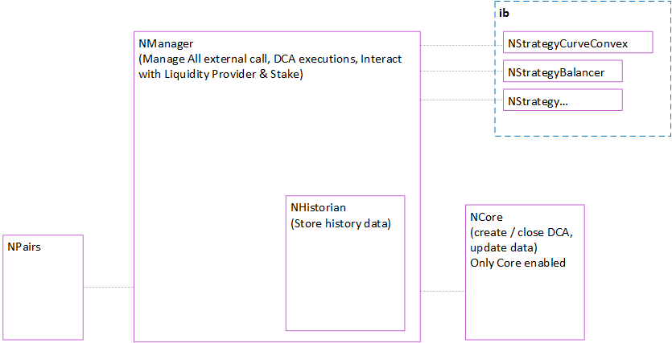

#  

This repository contains all contracts for protocol management `V3`

> [neonprotocol.io](https://neonprotocol.io/)

The aim is to give the user the possibility to perform DCA safely and without difficulty,
`DCA` that means Dollar-Cost-Averaging has historically been one of the most effective and less challenging way to invest into a market and NΞON Protocol makes it easy and automatic.


# Architecture

## Overview

It is made up of 4 main contracts.

| Name | Contract | Description |
|--------|---------|---------|
|`NManager`|Main|Manage the protocol, call by the UI and resolve flow|
|`NHistorian`|Abstract|Takes care of historicizing the data of past DCAs for each user|
|`NCore`|Secondary|Manages DCAs, from creation to execution|
|`NPairs`|Secondary|Listing and checking the validity of the tokens pairs set in the DCAs|

The main contract is NCore, which is made up of NHistorian and takes care of deploying everything it needs including NDCA and NParis which are the secondary contracts that are needed for correct functioning, due to a space issue it was not possible to insert them as `Abstract`.

In addition, n `strategies` are created to perform "Interest Bearing" with different combination of Liquidity provider and Yield Optimizer.

## Diagram



# Security Audit
> OnGoing...


# Settings
## Installation
```
$ npm install
```
## Compile
```
$ npx hardhat compile || npm compile
```
## Testing
```
$ npx hardhat test || npx hardhat test ./test/<testname>.js
```
## Deploy
```
$ npx hardhat run scripts/deploy.js --network <network-name>
```